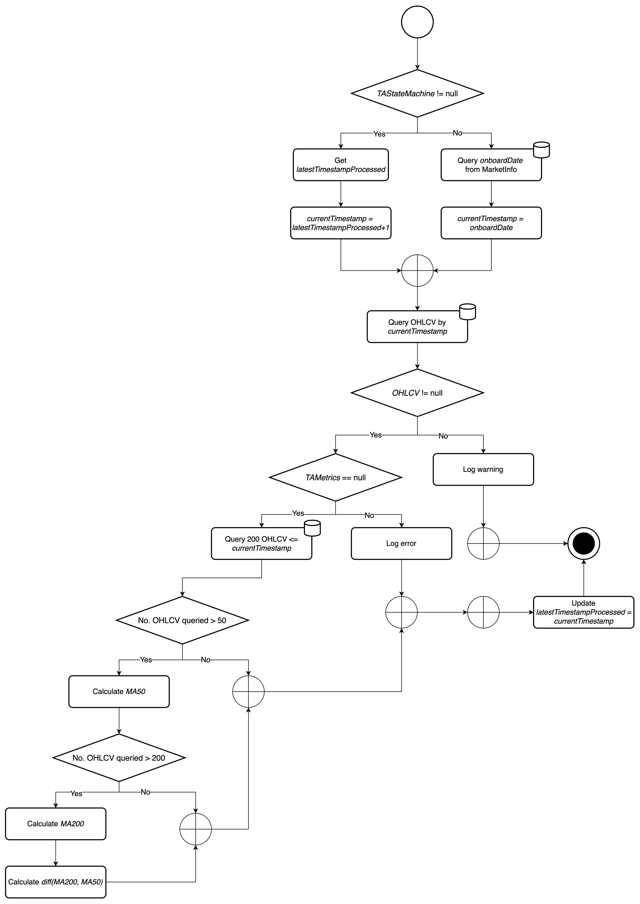

# Tradey Technical Analysis

## Flowchart


## Pre-commit
```shell
sam build --template tradey-market-info.yml --use-container
```

## Invoke with event
```shell
sam local invoke tradeytechnicalanalysis -t tradey-technical-analysis.yml -e events/event.json
```

## Guide
- Download and install dependencies from `pom.yml`
```shell
mvn dependency:resolve
```
- Compile source, run tests
```shell
mvn clean install
```